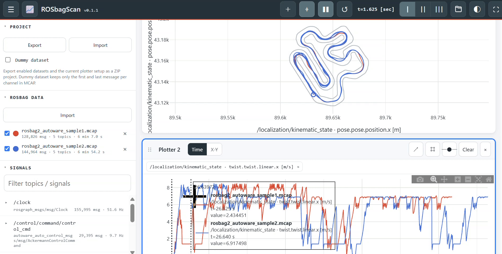

# ROSbagScan


## Overview
ROSbagScan is a browser-based tool for loading, comparing, and plotting ROS 2 rosbag2 data from MCAP and SQLite3 files.

## Version
Current development release: **v0.1.0**.

ROSbagScan uses [Semantic Versioning](https://semver.org/) with `major.minor.patch`. Major version `0` indicates active development.

Version 0.1.0 is the first release under the ROSbagScan name. Project ZIP files exported by ROS2bag Analyzer v0.0.18 remain importable.

## Quick Start
Open the web application:

https://covao.github.io/ROSbagScan/ROSbagScan.html

GitHub repository:

https://github.com/covao/ROSbagScan

## Features
- Editable plotter names and per-dataset line colors
- Dummy project datasets are replaced by matching real rosbags while preserving line colors
- Signal search includes engineering-unit text
- Reuse the smallest available Plotter number when a plotter is added.
- Hide signal and GeoJSON chips in X-Y mode to maximize graph area.
- Use a stronger GeoJSON outline and synchronized cursor line for visibility.
- Dark and light UI themes.
- Maximize any plotter to fill the workspace.
- Import GeoJSON road outlines into an X-Y plotter and render them as a background layer.
- Save and restore GeoJSON layers inside Project ZIP files.
- Project ZIP export/import for datasets and plotter setup
- Optional dummy MCAP export with first/last messages only
- Collapsible Rosbag data and Signals menu trees
- Signal checkboxes for the active plotter
- Synchronized cursor playback across plotters
- Load ROS 2 rosbag2 data from `.mcap`, `.db3`, and `.zip` files.
- Load files with the file picker or drag and drop.
- Load a Project ZIP from a URL with the `#project=` URL parameter.
- Load one or more rosbag files from URLs with repeated `#rosbag=` parameters.
- Keep compatibility with the legacy `#zip=` URL parameter.
- Load multiple rosbag datasets and compare the same signals.
- Enable or disable each rosbag dataset with a checkbox.
- Use a fixed line color for each rosbag dataset.
- Drag signals from the Signals menu to any plotter.
- Add, remove, and reorder plotters.
- Switch each plotter between Time and X-Y modes.
- Automatically switch to X-Y mode for recognizable X/Y signal pairs.
- Show lines with optional point markers.
- Use a synchronized cursor across all plotters.
- Move the synchronized cursor by clicking on plot data.
- Select one, two, or three plotter columns.
- Display signal names and inferred engineering units when available.
- Decode ROS 2 CDR messages using message schemas stored in MCAP files.
- Run entirely in the browser without uploading rosbag data to a server.

## Requirements
- A modern web browser
- WebGL enabled for accelerated Plotly rendering
- Recommended: latest Chrome, Edge, Firefox, or Safari
- Internet access for CDN libraries, or local library files for offline use

## Usage
Open `ROSbagScan.html` in a supported browser or serve it from a local web server. Load one or more rosbag files with the **Open files** icon or drag and drop `.mcap`, `.db3`, or `.zip` files into the application. Select the rosbag datasets to display, then drag signals from the **Signals** menu onto a plotter. Add more plotters from the title bar and select Time or X-Y mode for each plotter.

To load a Project ZIP automatically, use the `project` URL hash parameter:

```text
ROSbagScan.html#project=https%3A%2F%2Fexample.com%2FROSbagScan_project.zip
```

To load one rosbag directly from a URL, use `rosbag`:

```text
ROSbagScan.html#rosbag=https%3A%2F%2Fd3al8lo5i04x19.cloudfront.net%2F4f95d3ba-0015-46ca-9479-516e1e014d0e%2F1%2Frosbag2_autoware.mcap
```

To load multiple rosbag datasets, repeat the `rosbag` parameter. Each URL is loaded as a separate dataset:

```text
ROSbagScan.html#rosbag=https%3A%2F%2Fexample.com%2Frun1.mcap&rosbag=https%3A%2F%2Fexample.com%2Frun2.mcap
```

Comma-separated values are also accepted. `bag` and `mcap` are aliases, and the existing `zip` parameter remains supported for rosbag ZIP files. A Project URL can be combined with rosbag URLs; the Project is imported first and the rosbag datasets are then added.

Remote servers must allow cross-origin access (CORS). Encode URLs when they contain `&`, `#`, or other characters that have meaning in the browser URL.


For an X-Y plotter, click the `⌗` button to import a `.geojson` or `.json` file. Polygon and line geometries are rendered as road-outline background layers. Project Export automatically includes the imported GeoJSON files, and Project Import restores them.

## Reference
- [ROS 2 rosbag2](https://github.com/ros2/rosbag2): ROS 2 bag recording and playback framework.
- [MCAP](https://mcap.dev/): Container format for timestamped robotics and pub/sub data.
- [Plotly.js](https://plotly.com/javascript/): JavaScript plotting library used for interactive plots.
- [sql.js](https://sql.js.org/): SQLite compiled to WebAssembly for reading rosbag2 SQLite3 files in the browser.
- [JSZip](https://stuk.github.io/jszip/): JavaScript library used to read ZIP archives in the browser.
